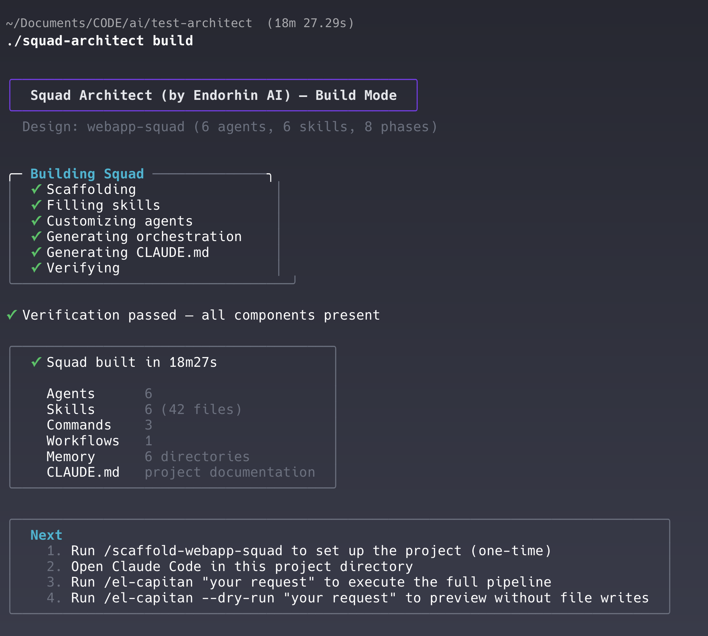

# Squad Architect

**by [Endorphin AI](https://endorphinai.dev/)**


Design and build multi-agent squads for [Claude Code](https://docs.anthropic.com/en/docs/claude-code). A compiled CLI tool that orchestrates AI agent teams — from squad design through build, audit, and adjustment.

## Install

### Quick install (macOS / Linux)

```bash
curl -fsSL https://raw.githubusercontent.com/endorphin-ai/squad-architect/main/install.sh | bash
```



### Manual download

Download the binary for your platform from [GitHub Releases](https://github.com/endorphin-ai/squad-architect/releases):

| Platform | Architecture | Download |
|---|---|---|
| macOS | Apple Silicon (M1/M2/M3/M4) | `squad-architect_*_darwin_arm64.tar.gz` |
| macOS | Intel | `squad-architect_*_darwin_amd64.tar.gz` |
| Linux | x86_64 | `squad-architect_*_linux_amd64.tar.gz` |
| Linux | ARM64 | `squad-architect_*_linux_arm64.tar.gz` |

Extract and move to your PATH:

```bash
tar -xzf squad-architect_*.tar.gz
sudo mv squad-architect /usr/local/bin/
```

## Update

To update to the latest version, run the same install command again:

```bash
curl -fsSL https://raw.githubusercontent.com/endorphin-ai/squad-architect/main/install.sh | bash
```

Check your current version:

```bash
squad-architect version --code=<YOUR_CODE>
```

## Usage

All commands require an access code provided by Endorphin AI.

```bash
# Interactive squad design session
squad-architect design --dir="/path_to_project/" --code=BETA_TESTER 
> Build squad for MEAN web app
> Approve / add agent / remove agent / add commands / add skill / describe changes

# Build squad from approved design
squad-architect build --dir="/path_to_project/" --code=BETA_TESTER

Next
1. Open Claude Code in this project directory                               
2. Run /el-capitan "your request" to execute the full pipeline

Simalation         
Run /el-capitan --dry-run "your request" to preview without file writes

#Advanced features require code ($)

# Audit an existing squad ($)
squad-architect audit --dir="/path_to_project/" --code=<YOUR_CODE>

# Modify a squad ($)
squad-architect adjust "your instruction" --dir="/path_to_project/" --code=<YOUR_CODE>

# Generate insight reports ($)
squad-architect insight health --dir="/path_to_project/" --code=<YOUR_CODE>
```
Team examples built with Architect.
🍕 One Pizza Team
https://github.com/endorphin-ai/claude-code-teams


## Requirements

- [Claude Code CLI](https://docs.anthropic.com/en/docs/claude-code) installed and authenticated
- macOS or Linux (amd64 or arm64)
- Access code from Endorphin AI

## Support

- Website: [endorphinai.dev](https://endorphinai.dev/)
- Issues: [GitHub Issues](https://github.com/endorphin-ai/squad-architect/issues)
